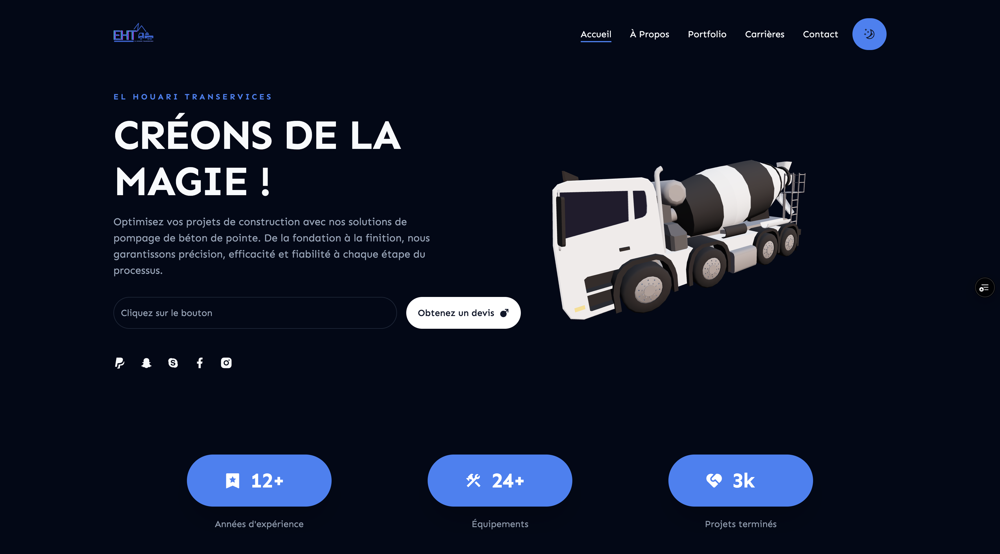
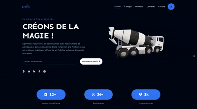

# 🌟 Landing Page For Concrete pumping company- Next.js

A stunning **Landing Page** built with **Next.js, Three.js, ShadCN, and Framer Motion** for smooth animations and immersive 3D experiences. 🚀

## 📸 Preview




## ✨ Features

- ⚡ **Next.js** for fast performance and SEO optimization.
- 🎭 **Framer Motion** for smooth animations.
- 🎨 **ShadCN UI** for elegant and customizable components.
- 🎲 **Three.js** for interactive 3D models.
- 🎯 Fully responsive and mobile-friendly design.

---

## 🚀 Getting Started

### 1️⃣ Clone the Repository
```bash
https://github.com/abdelaalimouid/Concrete-Pumping-Solutions.git
cd Landing-page-nextjs-
```

### 2️⃣ Install Dependencies
```bash
npm install  # or yarn install
```

### 3️⃣ Run the Development Server
```bash
npm run dev  # or yarn dev
```

🚀 Open [http://localhost:3000](http://localhost:3000) in your browser.

---

## 🛠 Tech Stack

- **Framework**: Next.js
- **Styling**: Tailwind CSS, ShadCN UI
- **Animations**: Framer Motion
- **3D Graphics**: Three.js
- **Deployment**: Vercel

---

## 🎥 Demo

| 🎬 GIF Demo |
|--------------|
|  |

Live Demo:  


---

## 🚀 Deployment

### Deploy on **Vercel** (Recommended)
Click the button below to deploy instantly:

[](https://vercel.com/import/project?template=https://github.com/abdelaalimouid/Concrete-Pumping-Solutions)

Or deploy manually:
```bash
vercel
```

---

## 🤝 Contributing

1. **Fork** this repository.
2. **Clone** your fork: `https://github.com/abdelaalimouid/Concrete-Pumping-Solutions.git`
3. **Create a branch**: `git checkout -b feature-branch`
4. **Make changes** and commit: `git commit -m 'Add new feature'`
5. **Push** to your fork: `git push origin feature-branch`
6. **Create a Pull Request** 🚀

---

## 📜 License

This project is licensed under the **MIT License**. Feel free to use and modify it as you like. 😊

---

## 📞 Contact

Have questions or suggestions? Reach out!

📧 Email: [abdelaalimouid@gmail.com](mailto:abdelaalimouid@gmail.com)  
🔗 LinkdeIn: [@abdelaalimouid](www.linkedin.com/in/abdelaalimouid)  
📌 GitHub: [abdelaalimouid](https://github.com/abdelaalimouid)  

---

💙 _Star this repo if you find it useful! ⭐_
